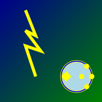

#  AI Energy Impact Visualizer

        

## Project Overview  
**Global Metrics:**  
- **Total Projects Visualized:** 42  
- **Total Energy Saved:** 1,500 MWh  
- **Total Carbon Offset:** 900 tons  

## Key Features  
1. **Feature 1: Visualize Energy Impact**  
   ```javascript  
   // Code example for feature 1  
   visualizeEnergyImpact(data);  
   ```  
2. **Feature 2: API Integration**  
   ```javascript  
   // Example fetching data from the API  
   fetchData(apiUrl);  
   ```  
3. **Feature 3: Interactive Charts**  
   ```javascript  
   // Initialize interactive charts  
   initChart('energyChart');  
   ```  
4. **Feature 4: User-friendly Dashboard**  
   ```javascript  
   // Render dashboard elements  
   renderDashboard();  
   ```  
5. **Feature 5: Data Download Options**  
   ```javascript  
   // Function to download reports  
   downloadReport();  
   ```  
6. **Feature 6: Notifications**  
   ```javascript  
   // Send notifications  
   sendNotification(user);  
   ```  
7. **Feature 7: Custom Reports**  
   ```javascript  
   // Generate custom reports  
   createCustomReport();  
   ```  

## System Architecture  
```
     +-------------+  
     |  Frontend   |  
     +------+------+
            |  
     +------+------+
     |   Backend   |  
     +------+------+
            |  
     +------+------+
     |  Database   |  
     +-------------+
```

## Quick Start  
### Docker Setup  
```shell  
docker-compose up  
```  
### Local Setup  
```shell  
npm install  
npm start  
```  

## Core Calculations  
- **Tokens Used:** Calculated based on the user interactions.  
- **Energy Consumption:** Total energy used by the system.  
- **Cost Estimates:** Based on the energy consumption.  
- **Carbon Lifecycle:** Total carbon output.  

## API Documentation  
### Endpoints  
- **GET /api/data**  
  ```bash  
curl -X GET 'http://api.example.com/data'  
  ```  

### Response  
```json  
{
  "data": []  
}  
```  

## Data Models  
```typescript  
interface EnergyData {
  id: number;
  energyUsed: number;
  userId: number;
}

interface User {
  id: number;
  name: string;
  email: string;
}
```  

## Project Structure  
```
├── src/  
│   ├── components/  
│   ├── services/  
│   └── utils/  
├── public/  
├── tests/  
└── README.md  
```  

## Testing Guide  
```shell  
npm test  
```  

## Research and Sources  
- **Energy Saving Report:** [Link](http://example.com/report)  
- **API Documentation:** [Link](http://example.com/api-docs)  

## Contributing  
1. Fork the repository  
2. Create your feature branch  
3. Commit your changes  
4. Push to the branch  
5. Open a pull request  

## License  
This project is licensed under the MIT License - see the [LICENSE](LICENSE) file for details.  

## Citation  
If you use this project in your work, please cite it as follows:  
```
@software{ai_energy_impact_visualizer,
  author = {Your Name},
  title = {AI Energy Impact Visualizer},
  year = {2026},
}
```  

## Footer  
**✨ Join us on this journey to a more sustainable future! 🌍**  
